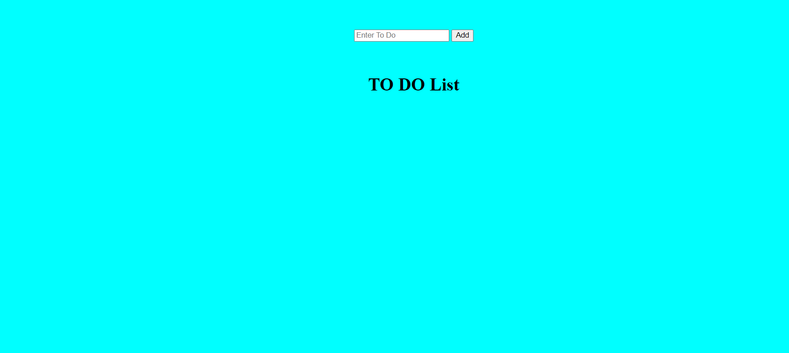

# To-Do App

## Description
I used HTML, CSS and Javascript to create a web-based to do app.  The goal of this application was to practice dynamically rendering HTML elements and modifying their styles/displays based on user events (clicks-events/form data etc).

## TRY IT
<a href='https://cdb8987.github.io/todo-app/'>HERE</a>

## Author

Charles Brinkman  https://www.linkedin.com/in/charlesbrinkman/